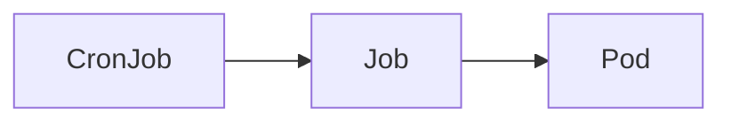

# cronjob-runner [](https://github.com/int128/cronjob-runner/actions/workflows/go.yaml)

This is a command to run a `Job` from `CronJob` in Kubernetes.
It is designed for running a one-shot job by yet another job infrastructure such as GitHub Actions or Jenkins.

## Getting Started

You can download the latest release from [GitHub Releases](https://github.com/int128/cronjob-runner/releases).
As well as you can install it by `go install github.com/int128/cronjob-runner@latest`.

To run a Job from the CronJob,

```shell
cronjob-runner [--namespace your-namespace] --cronjob-name your-cronjob-name
```

Create a CronJob before running a Job.
You can set `suspend` field to prevent CronJob controller from scheduling.
Here is an example for a one-shot job.

```yaml
apiVersion: batch/v1
kind: CronJob
spec:
  # NOTE: This is a one-shot job to be run by cronjob-runner.
  # Do not enable scheduling.
  suspend: true
  schedule: '@annually'
  jobTemplate:
    spec: # ...snip...
```

Here is an example of a [simple CronJob](e2e_test/simple.yaml).

```console
$ cronjob-runner --cronjob-name simple
05:00:00.093779 create.go:29: INFO Found the CronJob cronJob.namespace=default cronJob.name=simple
05:00:00.099071 create.go:55: INFO Created a Job job.namespace=default job.name=simple-rh2dx
apiVersion: batch/v1
kind: Job
# ...snip...
05:00:00.100613 informer.go:46: INFO Watching Pod job.namespace=default job.name=simple-rh2dx
05:00:00.100668 informer.go:39: INFO Watching Job job.namespace=default job.name=simple-rh2dx
05:00:00.102574 informer.go:53: INFO Job is found job.namespace=default job.name=simple-rh2dx
05:00:09.184628 informer.go:68: INFO Pod is created pod.namespace=default pod.name=simple-rh2dx-24hqx pod.phase=Pending
05:00:14.505913 informer.go:135: INFO Container is terminated pod.namespace=default pod.name=simple-rh2dx-24hqx container.name=example container.state=Terminated exitCode=0 reason=Completed message=""
05:00:14.505959 tail.go:32: INFO Tailing the container log pod.namespace=default pod.name=simple-rh2dx-24hqx container.name=example
|2023-11-05T05:00:13.791930301Z|default|simple-rh2dx-24hqx|example| + echo 'Hello, world!'
|2023-11-05T05:00:13.791929952Z|default|simple-rh2dx-24hqx|example| Hello, world!
|2023-11-05T05:00:13.792101232Z|default|simple-rh2dx-24hqx|example| + date
|2023-11-05T05:00:13.792892713Z|default|simple-rh2dx-24hqx|example| Sun Nov  5 05:00:13 UTC 2023
|2023-11-05T05:00:13.793053987Z|default|simple-rh2dx-24hqx|example| + uname -a
|2023-11-05T05:00:13.793787646Z|default|simple-rh2dx-24hqx|example| Linux simple-rh2dx-24hqx 6.2.0-1015-azure #15~22.04.1-Ubuntu SMP Fri Oct  6 13:20:44 UTC 2023 x86_64 GNU/Linux
|2023-11-05T05:00:13.794049895Z|default|simple-rh2dx-24hqx|example| + exit 0
05:00:15.633855 informer.go:99: INFO Pod is succeeded pod.namespace=default pod.name=simple-rh2dx-24hqx pod.phase=Succeeded
05:00:16.643259 informer.go:77: INFO Job is completed job.namespace=default job.name=simple-rh2dx
05:00:16.643584 main.go:42: INFO Stopped background workers
```

You can see the actual examples from [e2e-test workflow](https://github.com/int128/cronjob-runner/actions/workflows/e2e-test.yaml?query=branch%3Amain).

This command runs a job as follows:

- Create a Job from the job template of CronJob.
- Show the statuses of Job, Pod(s) and container(s) when changed.
- Tail the log streams of all containers.
- If the job is succeeded, exit with code 0. Otherwise, exit with code 1.

### Inject environment variables

To inject environment variables to all containers,

```shell
cronjob-runner [--namespace your-namespace] --cronjob-name your-cronjob-name --env KEY=VALUE
```

For example,

```console
$ cronjob-runner --cronjob-name CreateItem --env ITEM_NAME=example --env ITEM_PRICE=100
```

Do not inject any secret, because anyone can see it by the log or kubectl command.

## Design

### Owner references

This command sets the owner reference of a Job to the parent CronJob.
Here is the relationship of ownership.



When a Job is completed or failed, CronJob controller will clean up the outdated Jobs
if `spec.successfulJobsHistoryLimit` or `spec.failedJobsHistoryLimit` is set.
See [CronJob section of the official document](https://kubernetes.io/docs/concepts/workloads/controllers/cron-jobs/) for details.

### Less runtime injection

For IaC and GitOps principal, every resource should be managed as code.
This command does not allow any modification of the job template, except the environment variables.
