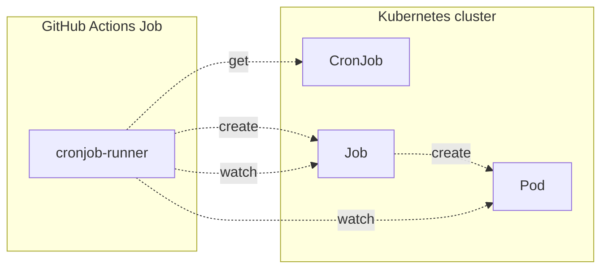
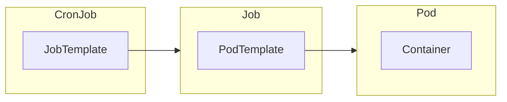

# cronjob-runner [](https://github.com/int128/cronjob-runner/actions/workflows/go.yaml)

This is a command to run a `Job` from `CronJob` in Kubernetes.
It is designed for running a one-shot job by yet another job infrastructure such as GitHub Actions or Jenkins.

When this command is run in GitHub Actions, it gets a CronJob and creates a Job in Kubernetes clusters.



## Getting Started

You can download the latest release from [GitHub Releases](https://github.com/int128/cronjob-runner/releases).
As well as you can install it by `go install github.com/int128/cronjob-runner@latest`.

To run a Job from the CronJob,

```shell
cronjob-runner [--namespace your-namespace] --cronjob-name your-cronjob-name
```

You need to create a CronJob before running a Job.
You can set `suspend` field to prevent CronJob controller from scheduling.
Here is an example for a one-shot job.

```yaml
apiVersion: batch/v1
kind: CronJob
spec:
  # NOTE: This is a one-shot job to be run by cronjob-runner.
  # Do not enable scheduling.
  suspend: true
  schedule: '@annually'
  jobTemplate:
    spec: # ...snip...
```

Here is an example output of a [simple CronJob](e2e_test/simple.yaml).
You can see the actual examples from [e2e-test workflow](https://github.com/int128/cronjob-runner/actions/workflows/e2e-test.yaml?query=branch%3Amain).

```console
$ cronjob-runner --cronjob-name simple
05:29:09.163225 main.go:34: INFO Found the CronJob cronJob.namespace=default cronJob.name=simple
05:29:09.168399 create.go:46: INFO Created a Job job.namespace=default job.name=simple-vww6r
...
05:29:09.169854 informer.go:46: INFO Watching Pod job.namespace=default job.name=simple-vww6r
05:29:09.169929 informer.go:39: INFO Watching Job job.namespace=default job.name=simple-vww6r
05:29:09.173155 informer.go:53: INFO Job is found job.namespace=default job.name=simple-vww6r
05:29:21.371217 informer.go:68: INFO Pod is created pod.namespace=default pod.name=simple-vww6r-v876l pod.phase=Pending
05:29:21.376853 informer.go:125: INFO Pod is not scheduled pod.namespace=default pod.name=simple-vww6r-v876l reason=Unschedulable message="0/1 nodes are available: 1 node(s) had untolerated taint {node.kubernetes.io/not-ready: }. preemption: 0/1 nodes are available: 1 Preemption is not helpful for scheduling."
05:29:23.329947 informer.go:122: INFO Pod is scheduled pod.namespace=default pod.name=simple-vww6r-v876l node=kind-control-plane
05:29:26.862470 informer.go:99: INFO Pod is running pod.namespace=default pod.name=simple-vww6r-v876l pod.phase=Running
05:29:26.862496 informer.go:181: INFO Container is running pod.namespace=default pod.name=simple-vww6r-v876l container.name=example
05:29:26.862529 tail.go:49: INFO Tailing the container log pod.namespace=default pod.name=simple-vww6r-v876l container.name=example
+ echo 'Hello, world!'
+ date
Hello, world!
Sat Mar 23 05:29:26 UTC 2024
+ uname -a
Linux simple-vww6r-v876l 6.5.0-1016-azure #16~22.04.1-Ubuntu SMP Fri Feb 16 15:42:02 UTC 2024 x86_64 GNU/Linux
+ exit 0
05:29:27.798466 informer.go:184: INFO Container is terminated pod.namespace=default pod.name=simple-vww6r-v876l container.name=example exitCode=0 reason=Completed message=""
05:29:28.885837 informer.go:101: INFO Pod is succeeded pod.namespace=default pod.name=simple-vww6r-v876l pod.phase=Succeeded
05:29:29.895247 informer.go:81: INFO Job is completed job.namespace=default job.name=simple-vww6r
05:29:29.895645 run.go:85: INFO Stopped background workers
```

This command runs a Job as follows:

1. Get the CronJob resource.
2. Create a Job resource from the job template.
3. When the status of Job, Pod or container is changed, show it.
4. When a container is started, tail the log stream.
5. When the Job status is succeeded, exit with code 0. Otherwise, exit with code 1.

Here is the relationship of Kubernetes resources.



### Inject environment variables

To inject environment variables to all containers,

```shell
cronjob-runner [--namespace your-namespace] --cronjob-name your-cronjob-name --env KEY=VALUE
```

For example,

```console
$ cronjob-runner --cronjob-name CreateItem --env ITEM_NAME=example --env ITEM_PRICE=100
```

Do not inject any secret, because anyone can see it by the log or kubectl command.

## Design

### Owner references

This command sets an owner reference from a Job to the parent CronJob.
For example,

```yaml
    ownerReferences:
    - apiVersion: batch/v1
      controller: true
      kind: CronJob
      name: simple
      uid: 948027a3-60af-41d2-8752-6a3be860a200
```

When a Job is completed or failed, CronJob controller will clean up the outdated Jobs
if `spec.successfulJobsHistoryLimit` or `spec.failedJobsHistoryLimit` is set.
See [CronJob section of the official document](https://kubernetes.io/docs/concepts/workloads/controllers/cron-jobs/) for details.

### Less runtime injection

For IaC and GitOps principal, every resource should be managed as code.
This command does not allow any modification of the job template, except the environment variables.
