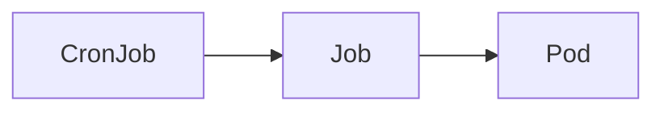

# cronjob-runner [](https://github.com/int128/cronjob-runner/actions/workflows/go.yaml)

This is a command to run a `Job` from `CronJob` in Kubernetes.
It is designed for running a one-shot job by yet another job infrastructure such as GitHub Actions or Jenkins.

## Getting Started

You can download the latest release from [GitHub Releases](https://github.com/int128/cronjob-runner/releases).
As well as you can install it by `go install github.com/int128/cronjob-runner@latest`.

To run a Job from the CronJob,

```shell
cronjob-runner [--namespace your-namespace] --cronjob-name your-cronjob-name
```

Create a CronJob before running a Job.
You can set `suspend` field to prevent CronJob controller from scheduling.
Here is an example for a one-shot job.

```yaml
apiVersion: batch/v1
kind: CronJob
spec:
  # NOTE: This is a one-shot job to be run by cronjob-runner.
  # Do not enable scheduling.
  suspend: true
  schedule: '@annually'
  jobTemplate:
    spec: # ...snip...
```

Here is an example with a [simple CronJob](e2e_test/simple.yaml).

```console
$ cronjob-runner --cronjob-name simple
04:03:14.740975 main.go:41: Cluster version v1.27.3
04:03:14.744844 create.go:27: Found the CronJob default/simple
04:03:14.751085 create.go:47: Created a Job default/simple-xv2g4
apiVersion: batch/v1
kind: Job
# ...snip...
04:03:14.751671 informer.go:41: Watching a pod of job default/simple-xv2g4
04:03:14.751708 informer.go:36: Watching the job default/simple-xv2g4
04:03:14.756822 informer.go:47: Job default/simple-xv2g4 is created
04:03:27.590782 informer.go:51: Pod default/simple-xv2g4-gtrv4 is Pending
04:03:34.989551 informer.go:68: Pod default/simple-xv2g4-gtrv4 is Running
04:03:34.989577 informer.go:81: Pod default/simple-xv2g4-gtrv4: Container example is running
04:03:34.989589 tail.go:18: Following the container log of default/simple-xv2g4-gtrv4/example
2023-10-31T04:03:34.032032575Z | default/simple-xv2g4-gtrv4/example | + echo 'Hello, world!'
2023-10-31T04:03:34.032057675Z | default/simple-xv2g4-gtrv4/example | + date
2023-10-31T04:03:34.032061375Z | default/simple-xv2g4-gtrv4/example | + uname -a
2023-10-31T04:03:34.032064275Z | default/simple-xv2g4-gtrv4/example | + exit 0
2023-10-31T04:03:34.032045275Z | default/simple-xv2g4-gtrv4/example | Hello, world!
2023-10-31T04:03:34.032071875Z | default/simple-xv2g4-gtrv4/example | Tue Oct 31 04:03:34 UTC 2023
2023-10-31T04:03:34.032075775Z | default/simple-xv2g4-gtrv4/example | Linux simple-xv2g4-gtrv4 6.2.0-1015-azure #15~22.04.1-Ubuntu SMP Fri Oct  6 13:20:44 UTC 2023 x86_64 GNU/Linux
04:03:35.754953 informer.go:85: Pod default/simple-xv2g4-gtrv4: Container example is terminated with exit code 0 (Completed)
04:03:36.840624 informer.go:68: Pod default/simple-xv2g4-gtrv4 is Succeeded
04:03:37.854908 informer.go:56: Job default/simple-xv2g4 is Complete 
04:03:37.855034 main.go:53: Stopped background workers
```

You can see the actual examples from [e2e-test workflow](https://github.com/int128/cronjob-runner/actions/workflows/e2e-test.yaml?query=branch%3Amain).

This command runs a job as follows:

- Create a Job from the job template of CronJob.
- Show the statuses of Job, Pod(s) and container(s) when changed.
- Tail the log streams of all containers.
- If the job is succeeded, exit with code 0. Otherwise, exit with code 1.

### Inject environment variables

To inject environment variables to all containers,

```shell
cronjob-runner [--namespace your-namespace] --cronjob-name your-cronjob-name --env KEY=VALUE
```

For example,

```console
$ cronjob-runner --cronjob-name CreateItem --env ITEM_NAME=example --env ITEM_PRICE=100
```

Do not inject any secret, because anyone can see it by the log or kubectl command.

## Design

### Owner references

This command sets the owner reference of a Job to the parent CronJob.
Here is the relationship of ownership.



When a Job is completed or failed, CronJob controller will clean up the outdated Jobs
if `spec.successfulJobsHistoryLimit` or `spec.failedJobsHistoryLimit` is set.
See [CronJob section of the official document](https://kubernetes.io/docs/concepts/workloads/controllers/cron-jobs/) for details.

### Less runtime injection

For IaC and GitOps principal, every resource should be managed as code.
This command does not allow any modification of the job template, except the environment variables.
